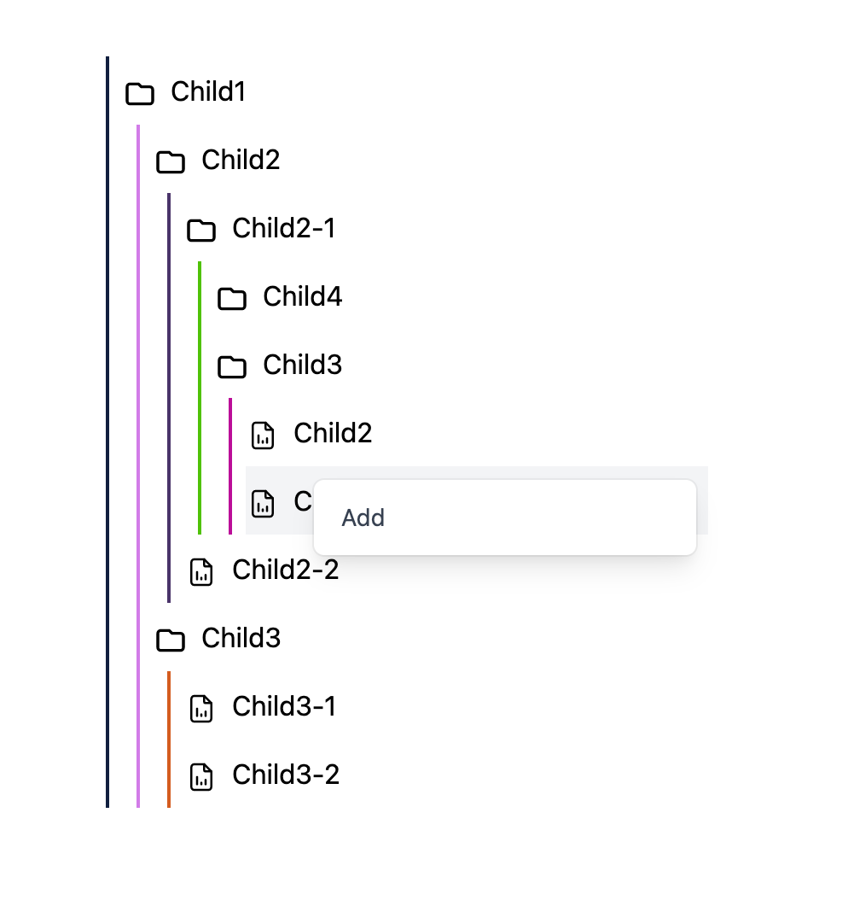

## TailwindCSS Tree View

React Tree View Component built on top TailwindCSS/TypeScript.

<div align="center" style="margin-top: 30px;">

</div>

## Example

```json
{
  "title": "root",
  "children": [
    {
      "title": "Child1",
      "children": [
        {
          "title": "Child2",
          "children": [
            {
              "title": "Child2-1",

            },
            {
              "title": "Child2-2",
              "children": []
            }
          ]
        }
    }
  ]
}
```

```tsx
export const Default = () => {
  return (
    <ContextMenuProvider>
      <ContextMenu />
      <Tree root={data} />
    </ContextMenuProvider>
  );
};
```

## Running the project

```js
yarn
yarn build:tailwind
yarn storybook
```

## Dependencies

- tailwindcss
- @headlessui/react
- typescript
